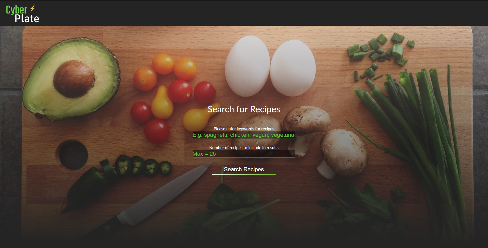
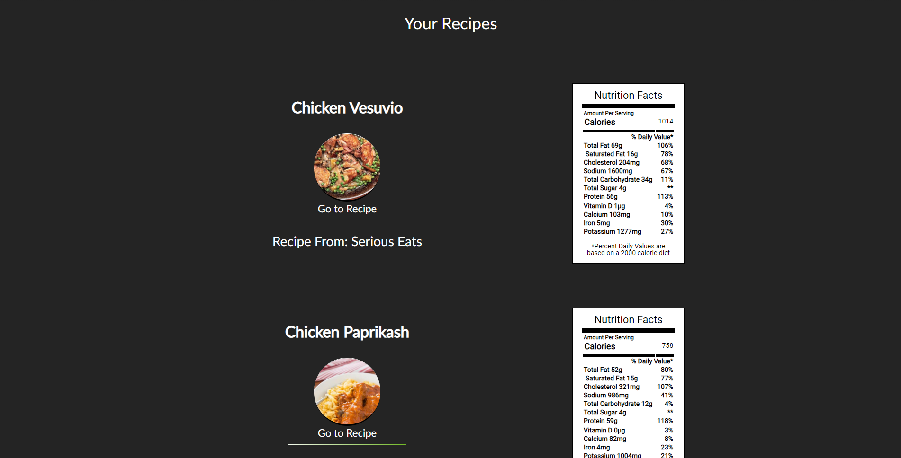

# Cyber Plate  
- An all in one search function to search for recipes and retreive the nutritional content of those recipes.  

## Github repository  
- https://github.com/reececb/Cyber-Plate  
## Live site  
- https://reececb.github.io/Cyber-Plate/

### Why is this app useful?  
- For the user that is concious about their diet choices, they can find new recipes to try out and see if  
they meet their dietary restrictions before even visiting the url for the recipe itself. It is easy for anyone to use,  
and can even find many abstract or uncommon recipes. It is responsively formatted for mobile, tablet, and desktop.

### Screenshots  
Landing page with search functions  
  

Recipe search results with nutritional information  
  

### Search function  
- There are two search bars on the landing page. The placeholders provide examples or explain the search function.  
- One is a text input to search for keywords and return related recipes.  
- The other is to set the number of results to return.  
- The maximum number of results the user can search for is 25.
- A message will display letting the user know to scroll down to see their search results when they have been displayed.  
- If a user inputs more than 25 into the quantity search bar, an error message will display letting them know to lower their quantity.  

### Results  
- Results will display in the section underneath the query/landing page.  
- The title, an image of the recipe, a url link, and where the recipe is from will be displayed.  
- A nutritional label with information will be displayed below or to the right of each recipe.  

## Key Technologies  
- HTML  
- CSS  
- JavaScript  
- jQuery  

## Author  
- Reece Bryant

